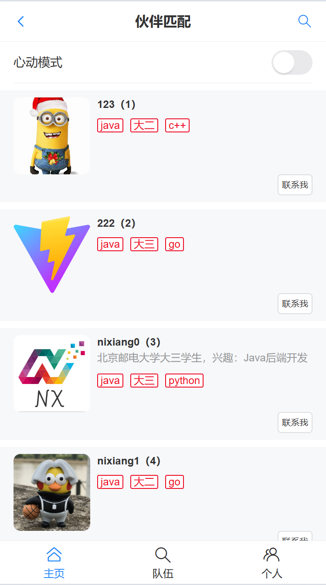
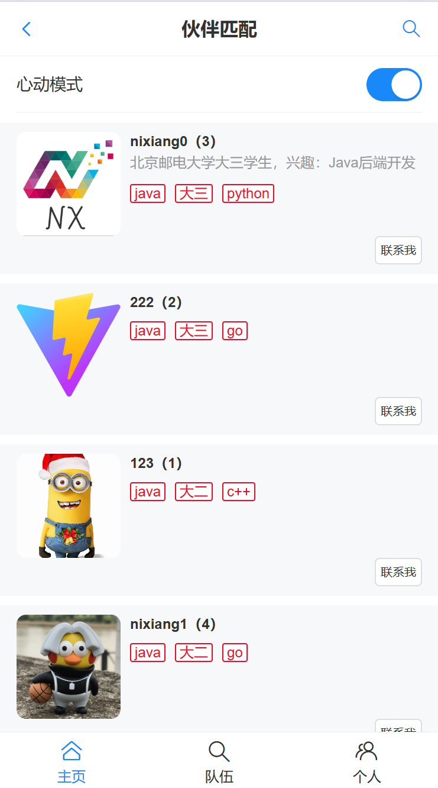
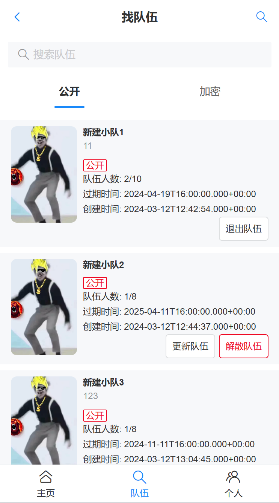
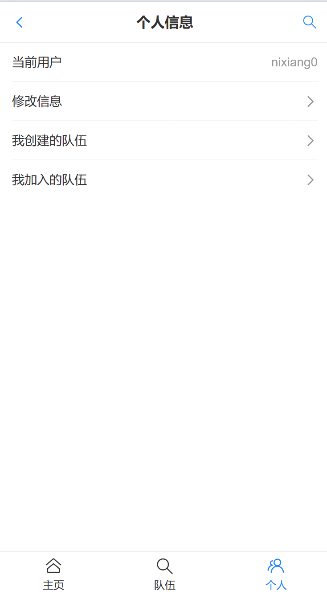

# XIANGYU - 学习伙伴匹配系统  

## 项目介绍

基于 Vue 3 + Spring Boot 的移动端网站，致力于为大家找到志同道合的学习伙伴，实现了用户管理、按标签检索用户、推荐相似用户、组队等功能

## 技术栈

### 前端

1. Vue 3 开发框架（提高页面开发效率）
2. Vant UI（基于Vue的移动端组件库）
3. Vite（打包工具，快）
4. Nginx来进行单机部署

### 后端

1. Java + SpringBoot
2. SpringMVC + MyBatis + MyBatis Plus
3. MySQL
4. Redis缓存
5. Swagger + Knife4j 接口文档

## 功能展示

### 首页默认推荐用户

### 按标签匹配度进行匹配推荐和排序

## 寻找和创建队伍进行组队

## 管理个人信息

